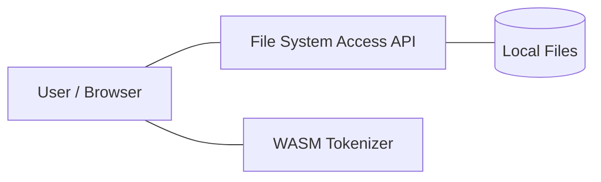

# 🍳 LMTokenCook


<div align="center">

[](LICENSE)
[](https://react.dev)
[](https://docker.com)
[](#)

**The AI Power-User's Context-Augmented Generation (CAG) Parsing Engine.**  
*Chop giant codebases into bite-sized "servings" for Gemini 1.5 Pro, Claude 3 Opus, and ChatGPT.*

[Features](#-features) • [Philosophy](#-core-philosophy) • [Architecture](#-architecture) • [Installation](#-installation)

</div>

---

## 🧐 Why LMTokenCook?

In the era of **Context-Augmented Generation (CAG)**, simply pasting code isn't enough. You need **precision**.

Most AI engineers struggle with context windows. "Paste this file" turns into "Content too long." `LMTokenCook` solves this by treating your codebase like a dataset. It recursively scans your repository, counts tokens in real-time, and **intelligently segments** your code into "servings" that perfectly max out your chosen LLM's context window.

> "There is a fundamental gap between what AI models **can** do and what web interfaces **allow** you to do. We bridge that gap by 'cheating' the prompt window mechanics locally on your machine."

---

## 🚀 Features

*   **⚡ Smart Scan & Extract**: Recursively scans folders, filtering out non-text assets (images, binaries, `.git` bloat) to ensure high-value focus.
*   **🔢 Structure & Tokenize**: Maps file hierarchy and counts tokens using `cl100k_base`—the exact encoding logic used by Frontier Models.
*   **🛡️ Pure Client-Side**: No data leaves your machine. Processing happens entirely in your browser using the File System Access API and WebAssembly.
*   **🐋 Docker Ready**: Spin up the environment with one command for a consistent, isolated workspace.

---

## 🧩 Architecture: Pure Frontend

LMTokenCook is a modern **Front-End Only** application. It leverages high-performance browser APIs to handle heavy-duty file processing without a backend.

### Tech Stack
- **UI**: React 18, Vite, TailwindCSS, Framer Motion.
- **Logic**: WebAssembly-powered TikToken for precise tokenization.
- **Access**: File System Access API for direct, high-speed directory scanning.
- **Deployment**: Dockerized Node.js environment with Cloudflare Tunnel support.

### System Topology


### The "Cooking" Process
1.  **Selection**: Pick a folder via the browser's native file picker.
2.  **Access**: Browser grants read-only access to your local files.
3.  **Scan**: The app walks the tree, ignoring patterns like `.git` and binary types.
4.  **Tokenization**: WASM-based TikToken calculates precise weight per file.
5.  **Chunking**: Logical segments are created to fill your target context window.
6.  **Serving**: Resulting text files are offered for instant download.

---

## 🛠️ Installation

### Docker 🐳 (Recommended)
Spins up the isolated frontend environment.

```bash
git clone https://github.com/DropShock-Digital/LMTokenCook.git
cd LMTokenCook
docker-compose up --build
```

**Access**: `http://localhost:5173`

### Local Development 💻

```bash
cd src/ui
npm install
npm run dev
# Run Tests
npm test
```

---

## 🧪 Testing

We maintain high standards for processing precision.

*   **Frontend**: `vitest` suite covers the core chunking logic to ensure no data loss during segmentation.
*   **CI**: GitHub Actions verify build integrity on every push.

---

## 📝 License

Distributed under the MIT License. See `LICENSE` for more information.

<div align="center">
  <strong>Built with 🧡 by DropShock Digital</strong><br>
  <em>Professional AI Solutions • Founder: Steven Seagondollar</em>
</div>
