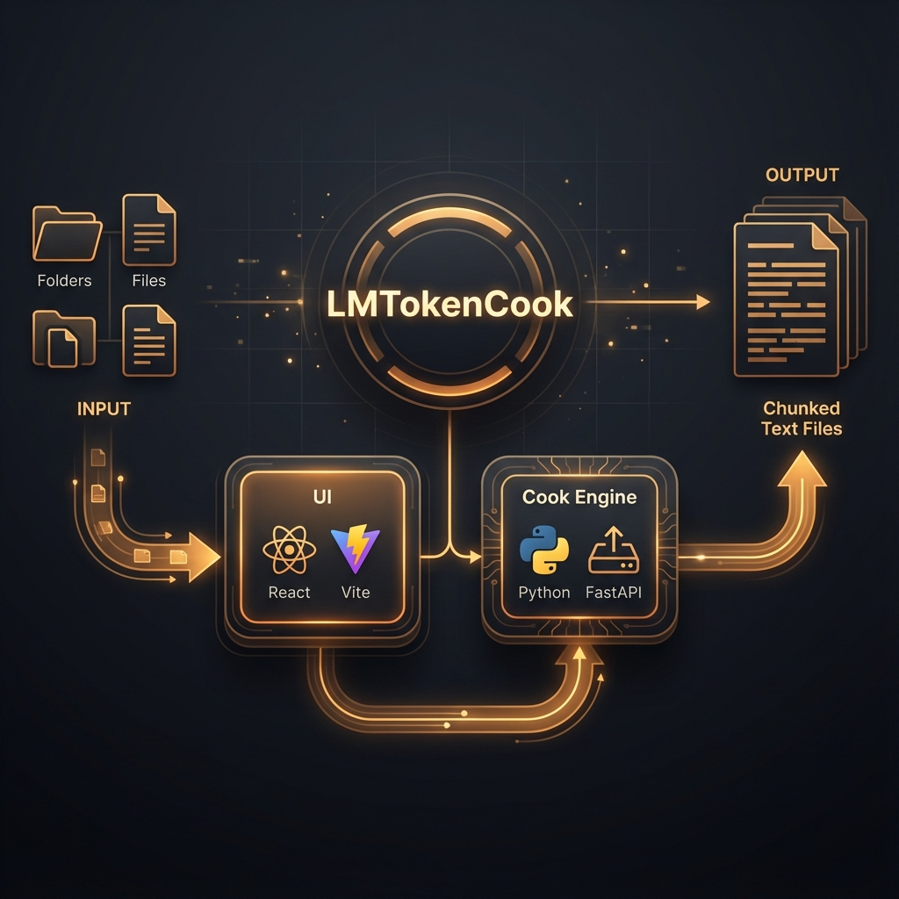

# LMTokenCook




**LMTokenCook** is a powerful, local-first tool designed to prepare large codebases for Large Language Model (LLM) context windows. It intelligently chunks, tokens, and formats your repository into "servings" that fit perfectly into tools like Gemini 1.5 Pro, Claude 3 Opus, or ChatGPT-4o.

## 🚀 Features

*   **Smart Chunking**: Automatically splits files based on token counts (using `tiktoken` logic) to ensure no context overflow.
*   **Safety First**: Runs entirely locally. Your code never leaves your machine unless you choose to use the cloud backend.
*   **Dual Architecture**: 
    *   **Browser Mode**: Uses the File System Access API for high-speed, client-side processing (React + WebAssembly).
    *   **Server Mode**: Optional Python FastAPI backend for headless automation and deeper integration (Docker ready).
*   **Context Optimization**: Features "Skip Empty Lines" and "Line Numbering" to maximize information density.
*   **Token Stats**: Visualizes token usage across your project.

## 🛠️ Installation & Usage

### Option 1: Docker (Recommended)

```bash
docker-compose up --build
```

Access the UI at `http://localhost:3000` (or `8000` depending on configuration).

### Option 2: Local Development

**Extension Backend (Python):**
```bash
# Install dependencies
pip install -r requirements.txt

# Run Server
uvicorn src.server.main:app --reload
```

**Frontend (React):**
```bash
cd src/ui
npm install
npm run dev
```

## 🏗️ Architecture

LMTokenCook leverages a modern split-stack architecture:

- **Frontend**: React, Vite, TailwindCSS, Framer Motion. Handles the UI and client-side chunks (for maximum privacy).
- **Backend**: Python FastAPI. Provides an API for headless operations (`/cook`) and statistics tracking.
- **Core**: Shared logic for token counting and text segmentation.

## 🧪 Testing

```bash
pip install pytest
pytest tests/
```

## 📜 License

This project is licensed under the MIT License - see the [LICENSE](LICENSE) file for details.

---

**Built by [DropShock Digital](https://dropshock.com)**
*Professional AI Solutions*
