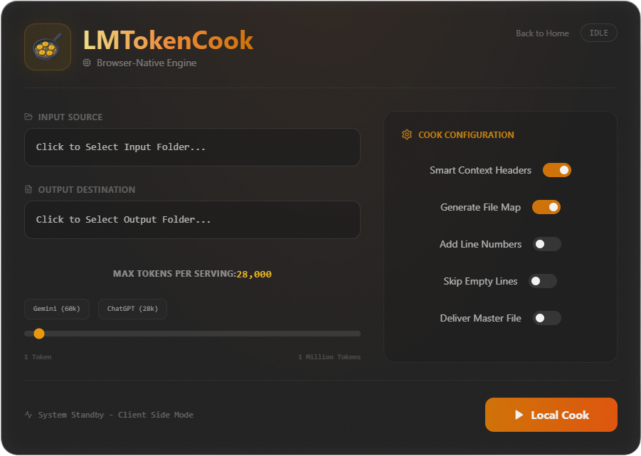
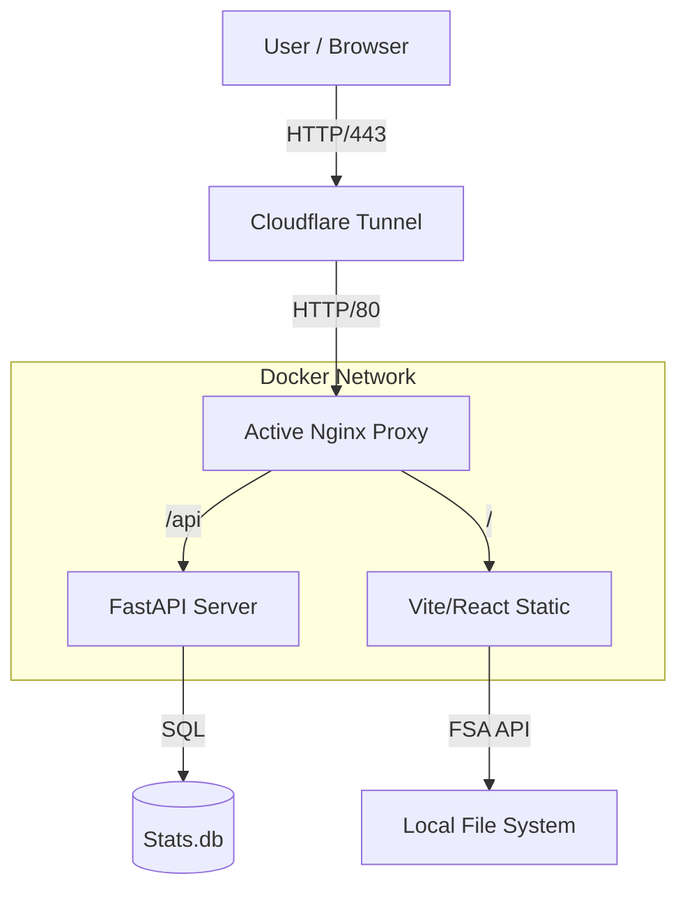

# 🍳 LMTokenCook



<div align="center">

[](LICENSE)
[](https://python.org)
[](https://react.dev)
[](https://docker.com)
[](#)

**The AI Power-User's Context-Augmented Generation (CAG) Parsing Engine.**  
*Chop giant codebases into bite-sized "servings" for Gemini 1.5 Pro, Claude 3 Opus, and ChatGPT.*

[Features](#-features) • [Philosophy](#-core-philosophy) • [Architecture](#-architecture) • [Installation](#-installation)

</div>

---

## 🧐 Why LMTokenCook?

In the era of **Context-Augmented Generation (CAG)**, simply pasting code isn't enough. You need **precision**.

Most AI engineers struggle with context windows. "Paste this file" turns into "Content too long." `LMTokenCook` solves this by treating your codebase like a dataset. It recursively scans your repository, counts tokens in real-time using model-native encoders, and **intelligently segments** your code into "servings" that perfectly max out your chosen LLM's context window (e.g., 128k for GPT-4o, 2M for Gemini 1.5 Pro).

> "There is a fundamental gap between what AI models **can** do and what web interfaces **allow** you to do. We bridge that gap by 'cheating' the prompt window mechanics."

---

## 🧠 Core Philosophy: Context Augmented Generation

This tool is built on three pillars of "Deep Context" reasoning:

### 1. Deep Reasoning
True reasoning requires global context. Instead of forcing an LLM to "search" for keywords (RAG), we let it "read" the whole book (CAG). This allows the model to:
- Identify hidden trends and cyclic dependencies scattered across hundreds of files.
- Eliminate "Lossy Summarization" by feeding raw source material directly.

### 2. Better Code
When the AI sees the full stack, it writes better code:
- Refactor complex architectures with full visibility of up/downstream effects.
- Generate integration tests that accurately reflect the logic of the entire repository.
- Standardize coding patterns across legacy and modern directories simultaneously.

### 3. Intelligent Servings
We don't just dump text. We inject **sequential logic headers** into every chunk. This strictly instructs the AI to 'hold state' and wait for the final file before executing, preventing premature or fragmented answers.

---

## 🚀 Features

*   **⚡ Smart Scan & Extract**: Recursively scans folders, filtering out non-text assets (images, binaries, `.git` bloat) to ensure high-value token density.
*   **🔢 Structure & Tokenize**: Maps file hierarchy and counts tokens using `cl100k_base`—the exact encoding logic used by Frontier Models. ensures mathematical precision.
*   **🧩 Dual-Head Architecture**:
    *   **Browser Mode (Glaze)**: Instant, zero-setup processing via WebAssembly and the File System Access API.
    *   **Server Mode (Iron)**: (Docker Only) A FastAPI backend for heavy-duty automation and statistics tracking.
*   **🔒 Local-First Privacy**: Your code is processed entirely in your browser or local Docker container. No cloud uploads to third-party servers.
*   **📊 Global Community Stats**: (Docker Only) Real-time tracking of tokens processed worldwide by the distributed network of "Cooks".

---

## 🧩 Architecture

LMTokenCook follows a **Unified Stack** pattern, designed for maximum flexibility (Local Dev vs. Power User Deployment).

### Tech Stack
- **Frontend**: React 18 (Vite), TailwindCSS, Framer Motion for "Glassmorphism" UI.
- **Backend**: Python 3.11, FastAPI, Uvicorn (Async).
- **Tokenization**: `js-tiktoken` (WASM) on the client, `tiktoken` (Python) on the server.
- **Container**: Docker Compose with Nginx Reverse Proxy and Cloudflare Tunnel integration.

### System Topology


### The "Cooking" Process (Sequence)
1.  **Selection**: User selects a folder via the browser's native file picker.
2.  **Access**: Browser grants read-only access to that specific directory.
3.  **Tokenization**: Browser-side WASM tokenizer calculates weight per file.
4.  **Chunking**: Algorithm slices content to fill the `Target Context Window`.
5.  **Serving**: Resulting text files are zipped and offered for download.

---

## 🛠️ Installation

### Option 1: The "Power-User" (Docker) 🐳
The recommended way to run. Spins up the Frontend, Backend, Nginx Proxy, and Cloudflare Sidecar.

```bash
git clone https://github.com/DropShock-Digital/LMTokenCook.git
cd LMTokenCook
docker-compose up --build
```

**Access**: 
- Local: `http://localhost:5173`
- Public: Check container logs for your unique `https://*.trycloudflare.com` URL (if Tunnel is enabled).

### Option 2: The "Contributor" (Local Dev) 💻
Run the stack natively for debugging or contributing.

**Backend (Python):**
```bash
cd src/server
pip install -r requirements.txt
uvicorn main:app --reload --port 8000
```

**Frontend (React):**
```bash
cd src/ui
npm install
npm run dev
# Tests
npm test
```

---

## 🧪 Testing

We maintain a rigorous standard of code quality.

*   **Frontend**: `vitest` suite covers the core chunking logic to ensure no data loss during the slicing process.
*   **Backend**: `pytest` for API endpoints and stats aggregation.
*   **CI**: GitHub Actions run on every push to `main` to verify build integrity.

---

## 📝 License

Distributed under the MIT License. See `LICENSE` for more information.

<div align="center">
  <strong>Built with 🧡 by DropShock Digital</strong><br>
  <em>Professional AI Solutions • Founder: Steven Seagondollar</em>
</div>
