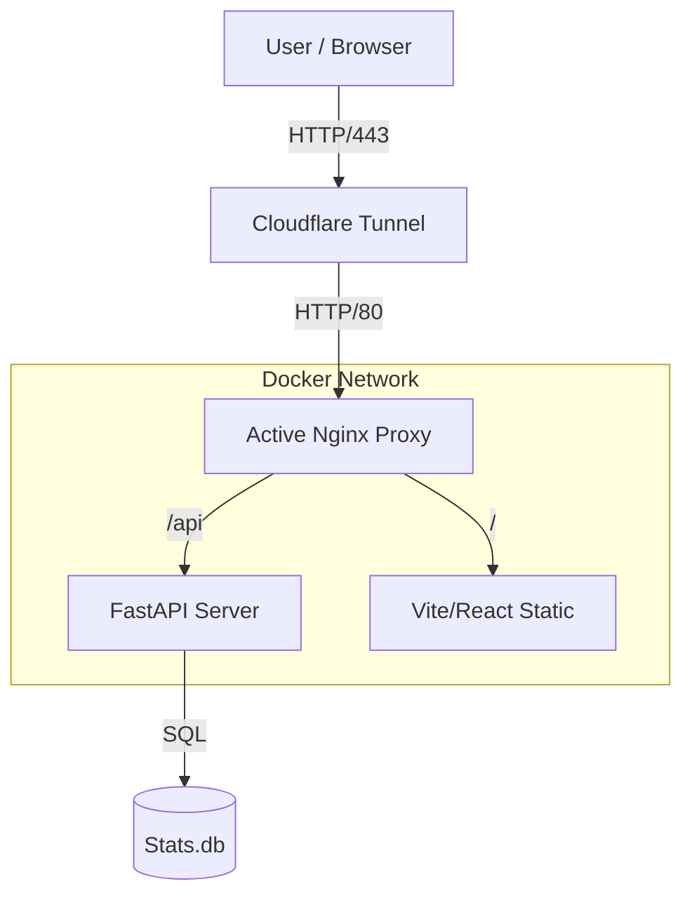
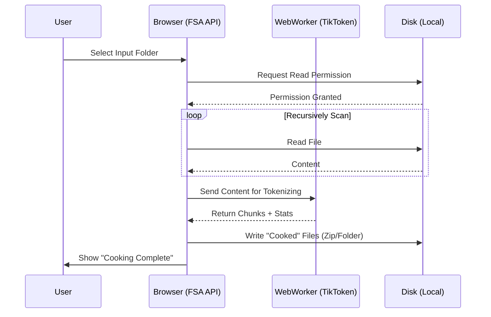

# 🍳 LMTokenCook


<div align="center">

[](LICENSE)
[](https://python.org)
[](https://react.dev)
[](https://docker.com)
[](#)

**The AI Power-User's Context-Augmented Generation (CAG) Parsing Engine.**  
*Chop giant codebases into bite-sized "servings" for Gemini 1.5 Pro, Claude 3 Opus, and ChatGPT.*

[Features](#-features) • [Installation](#-installation) • [Architecture](#-architecture) • [How It Works](#-how-it-works)

</div>

---

## 🧐 Why LMTokenCook?

In the era of **Context-Augmented Generation (CAG)**, simply pasting code isn't enough. You need **precision**.

Most AI engineers struggle with context windows. "Paste this file" turns into "Content too long." `LMTokenCook` solves this by treating your codebase like a dataset. It recursively scans your repository, counts tokens in real-time, and **intelligently segments** your code into "servings" that perfectly max out your chosen LLM's context window (e.g., 28k for ChatGPT, 60k for Gemini).

> "I couldn't paste 100k tokens of data into ChatGPT. So I built the workflow patching script that evolved into this tool."

## 🚀 Features

*   **🧠 Smart Context Headers**: Every chunk includes a header explaining *exactly* which file it came from and which part (e.g., "Part 1 of 3"), preserving model context retention.
*   **🔒 Local-First & Private**: Powered by the **File System Access API**. Your code is processed entirely in your browser or local Docker container. No cloud uploads.
*   **⚔️ Dual-Head Architecture**:
    *   **Browser Mode (Glaze)**: Instant, zero-setup processing via WebAssembly.
    *   **Server Mode (Iron)**: A FastAPI backend for heavy-duty, headless automation and statistics tracking.
*   **📊 Token Analytics**: Visualize the "weight" of your repository before you even start cooking.
*   **🐋 Docker Ready**: One command (`docker-compose up`) spins up the entire stack, including a secure Cloudflare Tunnel for remote access.

---

## 🛠️ Installation

### Option 1: The "Power-User" (Docker) 🐳
The recommended way to run. Spins up the Frontend, Backend, Nginx Proxy, and Cloudflare Sidecar.

```bash
git clone https://github.com/DropShock-Digital/LMTokenCook.git
cd LMTokenCook
docker-compose up --build
```

> **Access**: Open `http://localhost:5173`.
> **Public**: Check container logs for your unique `https://*.trycloudflare.com` URL.

### Option 2: The "Contributor" (Local Dev) 💻
Run the stack natively for debugging or contributing.

**Backend (Python):**
```bash
# In /src/server
pip install -r requirements.txt
uvicorn main:app --reload --port 8000
```

**Frontend (React):**
```bash
# In /src/ui
npm install
npm run dev
```

---

## 🧩 Architecture

LMTokenCook follows a **Dual-Head Monolith** pattern. See [STRUCTURE.md](STRUCTURE.md) for a deep dive into the folder structure.

### System Topology


---

## ⚙️ How It Works

<details>
<summary><strong>See the Data Flow (Click to Expand)</strong></summary>

### The "Local Cook" Loop
1.  **Selection**: You pick a folder via the browser's native file picker.
2.  **Access**: The browser grants read-only access to that specific directory.
3.  **Scan**: The app recursively walks the tree, ignoring patterns in `.dockerignore`.
4.  **Tokenization**: An in-browser WASM tokenizer (TikToken) calculates weight.
5.  **Chunking**: The algorithm slices files at line breaks to fill the `Target Context Window` (e.g., 28,000 tokens).
6.  **Serving**: Resulting text files are zipped and offered for download.


</details>

---

## 🧪 Testing & CI/CD

We maintain a rigorous standard of code quality.

*   **Linting**: Strict `flake8` implementation for Python.
*   **Testing**: `pytest` suite covers the core chunking logic to ensure no data loss.
*   **CI**: GitHub Actions run on every push to `main`.

Run tests locally:
```bash
python -m pytest tests/
```

---

## 🤝 Contributing

We welcome Pull Requests! Please see the [Issues](https://github.com/DropShock-Digital/LMTokenCook/issues) tab for "Good First Issues".

1.  Fork the Project
2.  Create your Feature Branch (`git checkout -b feature/AmazingFeature`)
3.  Commit your Changes (`git commit -m 'Add some AmazingFeature'`)
4.  Push to the Branch (`git push origin feature/AmazingFeature`)
5.  Open a Pull Request

---

## 📜 License

Distributed under the MIT License. See `LICENSE` for more information.

---

<div align="center">
  <strong>Built with 🧡 by DropShock Digital</strong><br>
  <em>Professional AI Solutions</em>
</div>
